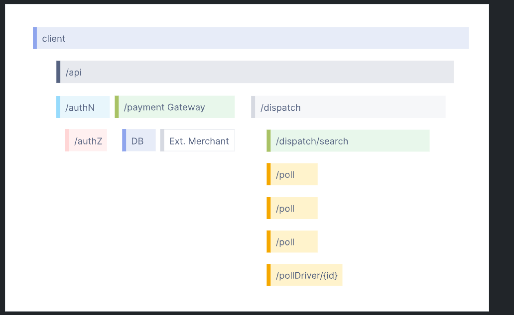

## Observability, monitoring, and logging

- this should go over what is observability, monitoring, and logging
- common tools for this

### In cluster monitoring

- So in cluster monitoring pertains to more health of pods, services, deployments, etc
- It doesn't and shouldn't cover application monitoring - which is a seperate topic talked about below
- For new clusters - we can either use
  - resource metrics
    - provides a limited set of metrics related to cluster components like HPAs
    - meant to be short-term, lightweight, in memory and exposed by the metrics api
  - full metrics pipeline
    - tons of open source projects that are pluggable into kubernetes
    - # of monitoring projects that work by scraping metric data

### Observability

- Let's us understand a system from the outside without having to understand the inner workings of the system
- It also allows us to troubleshoot problems and answer questions like "why is this happening?"
- To answer these questions and ask others - our code must be `instrumented`
  - meaning that the application code must emit these three signals
    - traces
    - metrics
    - logs
- an application is considered `instrumented` when developers don't need to add more instrumentation to troubleshoot an issue

### Reliability and Metrics

- Telemetry refers to the metrics and data generated from the system.
- The data can come in the form of traces, metrics, or logs
- Reliability answers the question of `is the system doing what we expect that it's doing?`
- Metrics are aggregations over a period of time representing data about your infrastructure or application
  - Things like error rate, CPU utilization, and request rate for a given service
- SLI -> Service Level Indicator
  - represents a measurement of service behavior
  - a good SLI measures your service from the perspective of your users
  - like how fast your web page loads
- SLO -> Service Level Objective
  - represents the reliability that is communicated to an organization or teams
  - accomplished by attaching SLIs to business values

### What is Distributed Tracing

- Distributed tracing allows insight into requests as they proprogate through complex, distrubted systems
- Distributed tracing improves visibility into our application's health and allows us to debug issues that are difficult to reproduce locally
  - if we have x number of services for one website, how do we know at what point which service fails?
  - distributed tracing helps solve this question
- There's 3 parts to distributed tracing
  - traces - Traces follow the life of the request as it goes from service to service - A trace is made up of one or more spans - first one being the root span, and each root span represents a request from start to finish - Most tracess are seen as waterful diagrams like the below
    
  - spans
    - usually represent a unit of work or operation
    - span's are usually helpful in painting a picture of what operations a request makes, painting a picture of what happened during that operation
    - span's usually contain name, logs, and metadata to provide information about the operation it made
  - logs
    - pretty much just standard logs in an application
    - not much help by themselves, but helpful in spans, or correlated with a trace
    - used by developers to understand system behavior
